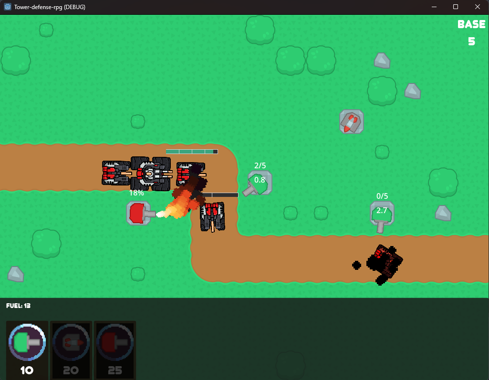
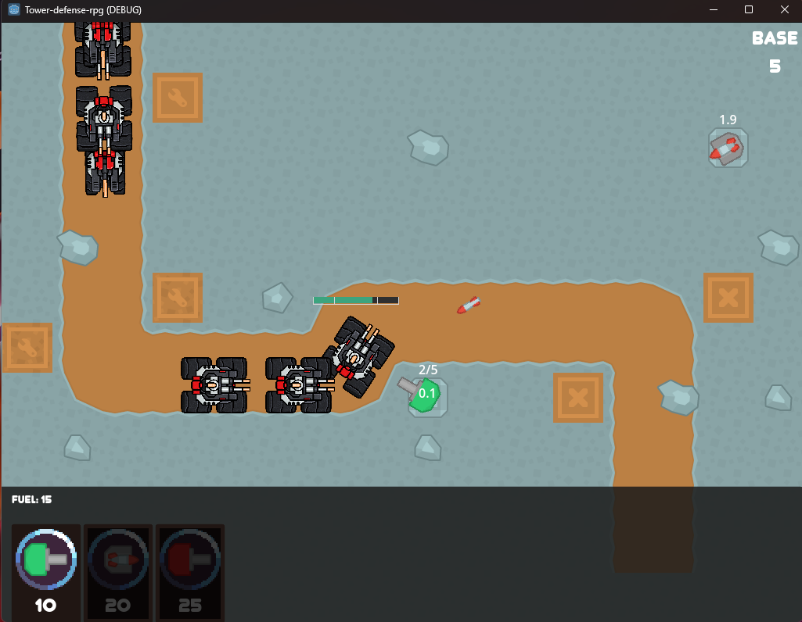

# godot-trpg
2D Tower Defence, разработанная на движке Godot.

 Скриншоты из игры 

## Реализовано
<ul>
<li> Главное меню. </li>
<li> Два уровня, система переключения уровней и завершения игры (возврат в меню) </li>
<li> Оборонительные башни:
  <ul>
  
  <li> <strong>Башня с магазинной системой стрельбы.</strong>
  Стреляет обычным пулями. Средний радиус поражения. Имеет магазин на 5 снарядов, задержка между выстрелами очень маленькая, 
  но компенсируется долгой перезарядкой всего магазина.
  </li>
  
  <li> <strong>Ракетная башня.</strong>
  Стреляет автонаводящимися ракетами. Большой радиус поражения. Медленная скорость полета снаряда. Большой урон. Долгая перезарядка.
  </li>
  
  <li> <strong>Огнеметная башня.</strong> 
  Выпускает конусуобразную струю пламени. Наносит урон всем целями в области огнеметной струи. Маленький радиус поражения. 
  При непрерывной активации перегревается и требует некоторое время для полного охлаждения. Автоматически охлаждается, если не ведет огонь по противнику.
  </li>
  
  </ul>
 </li>
 <li> Противники:
  <ul>
  
  <li> <strong>Легкий танк.</strong> 
  Быстрый танк, но имеет малый запас очков прочности. 
  </li>
  
  <li> <strong>Тяжелый танк.</strong>
  Медленный танк, но с большим количеством очков прочности.
  </li>
  
  </ul>
 </li>
 <li> Системы постройки башен с отображением полупрочрачной сетки. </li>
 <li> Панель для покупки башен. Заработок валюты при убийстве врага. </li>
 </ul>
 
## Запланировано
<ul>
<li> Продажа башен. </li>
<li> Награды за уровень. </li>
<li> Главное меню. Ангар для улучшения башен. </li>
<li> Система улучшения башен </li>
<li> Полное обновление UI-компонентов </li>
</ul>
